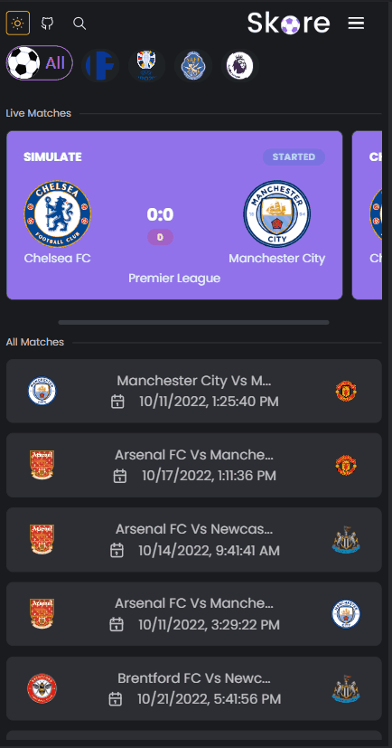
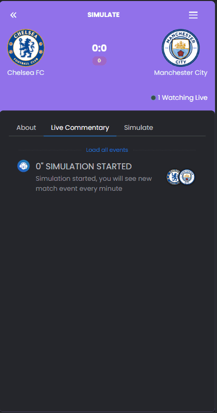
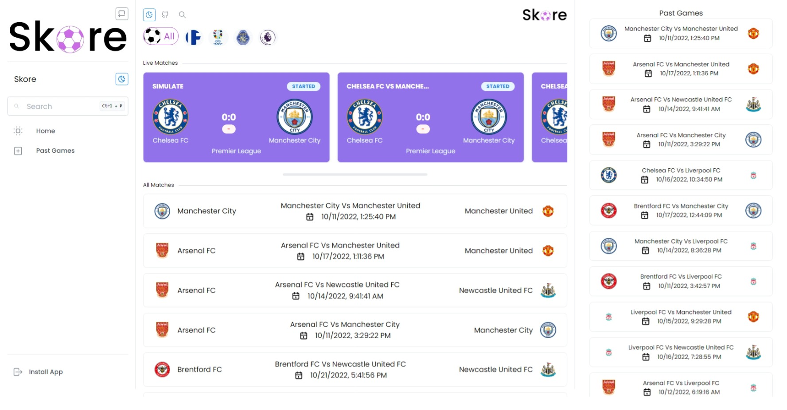
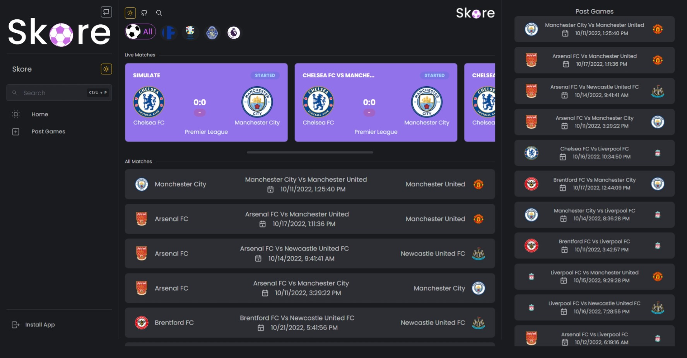
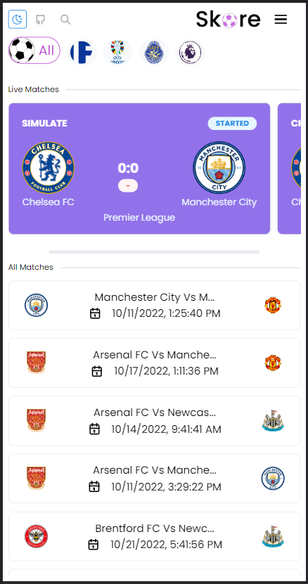
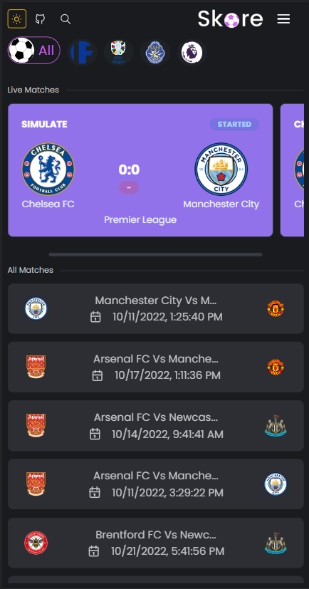

[![Contributors][contributors-shield]][contributors-url]
[![Forks][forks-shield]][forks-url]
[![Stargazers][stars-shield]][stars-url]

<!-- PROJECT LOGO -->
<br />
<p align="center">
  <a href="https://github.com/Parajulibkrm/Live-Sports-Score">
    
  </a>

  <h3 align="center">Skore- Live Score Application</h3>

  <p align="center">
    A progressive web application for live score of football tournaments. Useful to host you own app for small events and leagues.
    <br />
    <a href="#about-the-project"><strong>Explore the readme »</strong></a>
    <br />
    <br />
    <a href="https://github.com/Parajulibkrm">Author</a>
    ·
    <a href="https://github.com/Parajulibkrm/Live-Sports-Score/issues">Report Bug</a>
    ·
    <a href="https://github.com/Parajulibkrm/Live-Sports-Score/issues">Request Feature</a>
  </p>
</p>

<!-- TABLE OF CONTENTS -->
<details open="open">
  <summary>Table of Contents</summary>
  <ol>
    <li>
      <a href="#about-the-project">About The Project</a>
      <ul>
        <li><a href="#built-with">Built With</a></li>
      </ul>
    </li>
    <li>
      <a href="#getting-started">Getting Started</a>
      <ul>
        <li><a href="#prerequisites">Prerequisites</a></li>
        <li><a href="#installation">Installation</a></li>
        <li><a href="#config">Config</a></li>
      </ul>
    </li>
    <li><a href="#license">License</a></li>
    <li><a href="#contact">Contact</a></li>
  </ol>
</details>

# About the project

A responsive progressive web app using Pusher.js to broadcast and view live score and commentary for football events.

- [x] Realtime
- [x] Lazy Loaded
- [x] Responsive
- [x] Installable

<a href="#" target="_blank"></a>

<p align="center">
  <a href="#" target="_blank"></a>
</p>





<a href="#" target="_blank"></a>

<p align="center">
  <a href="#" target="_blank"></a>
</p>


This repository is accompanied by the following repository.
# Backend

<a href="https://github.com/Parajulibkrm/Skore-backend">
  <!-- Change the `github-readme-stats.anuraghazra1.vercel.app` to `github-readme-stats.vercel.app`  -->
  
</a>    

## Built With
This is the list of technologies that we are using for the project. 
* [Node js](https://nodejs.org/en/)
* [Express](http://expressjs.com/)
* [Deta Base](http://deta.sh/)
* [Pusher](https://pusher.com/)
* [React](https://reactjs.org/)
* [Vite](https://vitejs.dev/)
* [Typescript](https://www.typescriptlang.org/)
* [Mantine](http://mantine.dev/)


# Getting Started
## Prerequisites

*You need to have [`node v14.16.0`](https://nodejs.org/en/) or later to run this project since we're using es6+ features*

Create a deta base account from [here](https://web.deta.sh/) and make a project and obtain credentials.

Create account and start a Pusher Project from [here](https://pusherc.com). 

Start backend server. Check this [Repo](https://github.com/parajulibkrm/Skore-backend).

## Installation

**Clone the repository to your device.**
```bash
git clone https://github.com/Parajulibkrm/Live-Sports-Score.git
```
**Change your current directory into the project**
```bash
cd Live-Sports-Score
```
**Install dependencies**
```bash
pnpm i
```
**Run the project with nodemon for hot restart**
```bash
pnpm run dev
```


## Config

Set your configuration to `.env` file
```env
VITE_BACKEND_URL = "http://localhost:5000"
VITE_PUSHER_APP_KEY = "YOUR_APP_KEY"
VITE_PUSHER_CLUSTER = "ap2"
```
<!-- CONTACT -->
## Contribution

- Bikram Parajuli - [@Parajulibkrm](https://twitter.com/Parajulibkrm) 
- Pratikshya Pouudel - [@Pratikxya](https://github.com/Pratikxya)

[contributors-shield]: https://img.shields.io/github/forks/parajulibkrm/Live-Sports-Score?style=for-the-badge
[contributors-url]: https://github.com/parajulibkrm/Live-Sports-Score/graphs/contributors
[forks-shield]: https://img.shields.io/github/forks/parajulibkrm/Live-Sports-Score?style=for-the-badge
[forks-url]: https://github.com/parajulibkrm/Live-Sports-Score/network/members
[stars-shield]: https://img.shields.io/github/stars/parajulibkrm/Live-Sports-Score?style=for-the-badge
[stars-url]: https://github.com/parajulibkrm/Live-Sports-Score/stargazers